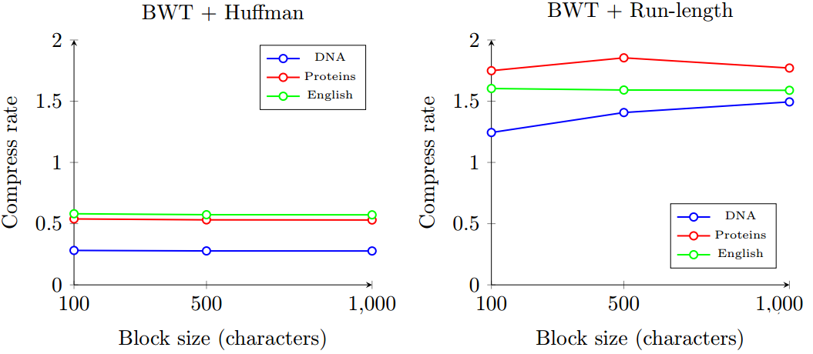

# Text-Compressor

This is a multimidia project made to study compression rate of text files with the following algorithms:

* Run-Length
* Huffman
* Burrows–Wheeler transform

###  Version

1.0.0

### Download

You can download the stable version 1.0.0 in the tab release, there is also a distribution. To run, it requires [Java SE Runtime Environment 8][jre] and for developers it requires [Java SE Development Kit 8][jdk].

### How to use

Text Compressor performs compression and decompression operations indicated by argument on the command line. For example, you can compress with Huffman:

```
TextCompressor.jar encode -i source.txt -o  encode.txt --bwt=false --huffman=true --runl=false
```

BWT and Run-Lenght:

```
TextCompressor.jar encode -i source.txt -o  encode.txt --bwt=true --txtblck=8 --huffman=true --runl=false
```

To decompress, use:

```
TextCompressor.jar decode -i encode.txt -o  decode.txt
```

TextCompressor will find out in the header of the file which compressions were previously applied , so there is no need to indicate which algorithm to use.

### Results

As this is a project to study, and not discover the best compression with the best time, compression rate of text files here are the results achieved:





Three kinds of files were used, with a size of 50 MB, 100 MB and 200 MB each one (you can find them [here][sourceFiles]):

* DNA sequences
* Proteins sequences
* English texts

For multiple compressions to the same file, the order applied it's BWT first, then Run-Lenght and then Huffman.

Isolated Huffman coding had the best results, obtaining very satisfactory compression rates that is independent of the file size (horizontal lines on the chart).

The Huffman encoding in different types of texts has efficient and fast results, while other encodings need combinations, choice of block size and favorable text field to obtain satisfactory compression. The run-length encoding after application BWT tends to increase compression, but still doesn't provide good compression ratios.

### Credits

Project made with the assistance of Marcelo Manzato and Rafael D'Addio.

The following libraries was useful:

* [Docopt][docopt]
* [BitInputStream][bitInput] and [BitOutputStream][bitOutput]

### License

[MIT][license]

[jre]:[http://www.oracle.com/technetwork/java/javase/downloads/jre8-downloads-2133155.html]
[jdk]:[http://www.oracle.com/technetwork/java/javase/downloads/jdk8-downloads-2133151.html]
[sourceFiles]:[http://pizzachili.dcc.uchile.cl/texts.html]
[docopt]:[https://github.com/docopt/docopt.java]
[bitInput]:[https://www.cs.duke.edu/courses/cps100e/current/assign/huff/code/BitInputStream.html]
[bitOutput]:[https://www.cs.duke.edu/csed/poop/huff/fall06/code/BitOutputStream.java]
[license]:(LICENSE)